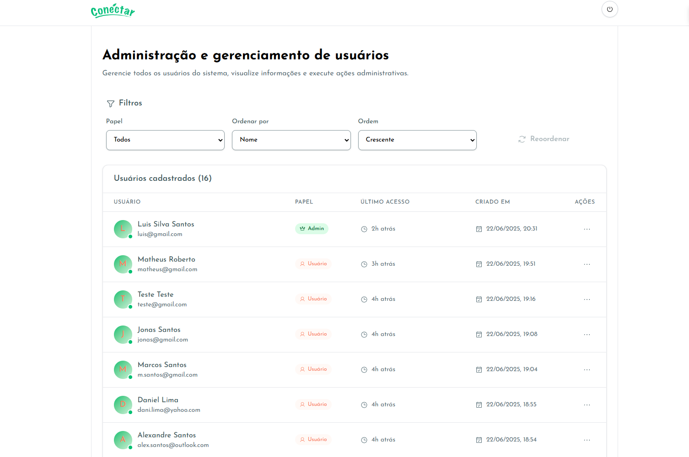
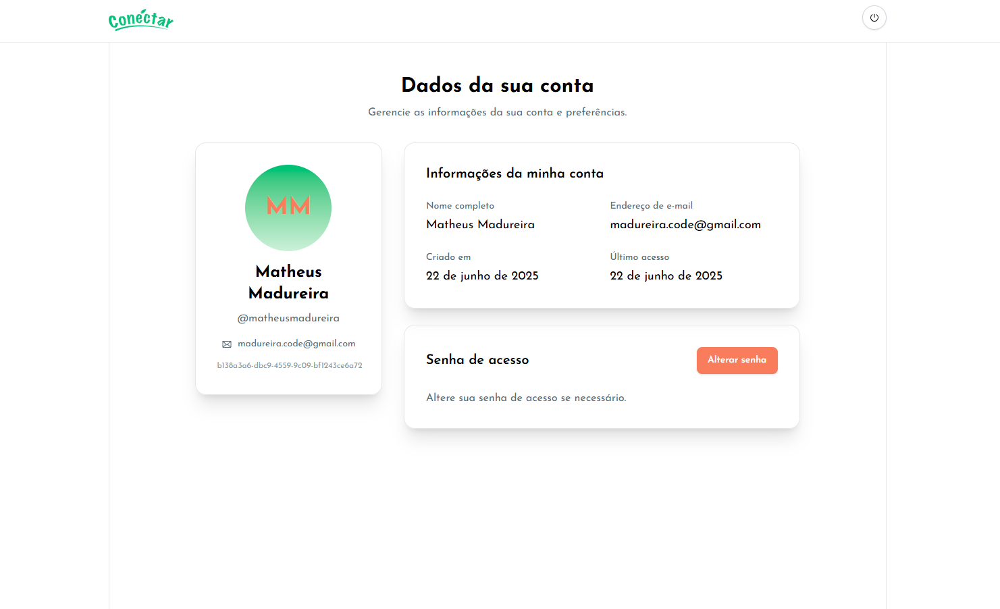

<div align="center">
  <a href="https://www.conectarapp.com.br/" target="blank"></a>
</div>

&nbsp;

<div align="center">

[](https://skillicons.dev)

</div>

## 🛠️ Configuração do Projeto

Na raiz do projeto, execute o comando abaixo para instalar todas as dependências:
```bash
$ pnpm install
```

## ⚡ Executando a Aplicação

```bash
# Executa a aplicação
$ pnpm run dev

# Fazer build da aplicação
$ pnpm run build

# Rodar o lint
$ pnpm run lint
```

## Funcionalidades da aplicação

> Usuários com a role `admin` possuem as seguintes funcionalidades:

* Visualizar todos os usuários do sistema.
* Utilizar filtros na busca dos usuários do sistema.
* Editar usuários do sistema.
* Deletar usuários do sistema.

<div align="center">
  
</div>

&nbsp;

> Usuários com a role `user` possuem as seguintes funcionalidades:

* Visualizar informações do próprio perfil.
* Atualizar a senha de acesso ao sistema.

<div align="center">
  
</div>

## Backend da aplicação

O repositório com todo o código do backend desta aplicação se encontra no link abaixo:

[Link do repositório](https://github.com/black-adm/nestj-conectar-backend)
